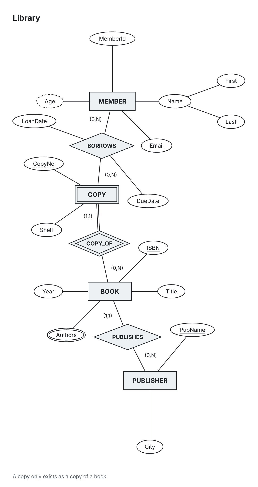

# chen-er

chen-er turns a YAML conceptual database model into a Chen ER diagram. People
and agents describe entities, attributes and relationships; the layout engine
places the shapes and the renderer draws them. Participation uses `(min,max)`
labels beside each entity, describing **that entity's participation** at that end.

The goal is a reviewable model and diagram, rather than a drawing whose meaning
is hidden in manually positioned shapes. Candidate keys, weak entities,
composite attributes, recursive relationships and n-ary relationships remain
explicit in the source.



[Open the vector version](docs/library.svg). Source: [library.er.yaml](examples/library.er.yaml).

## Install and quick start

Use Node.js 24. From a source checkout:

```sh
npm install
npx tsx src/cli/index.ts render examples/library.er.yaml -o docs/library.svg --png
```

For ongoing development, `npm run chen -- render model.er.yaml --png` runs the
same source entry point. A built installation exposes `chen` through
`bin/chen.js`; build the TypeScript first with `npm run build`.

The render command writes an SVG and, with `--png`, a PNG using bundled Inter
fonts. Keep the YAML alongside the output so changes can be reviewed and rendered
again. Do not use a clean lint result as proof that a conceptual model is correct.

**Status:** v0.1. Rendering, layout (`layered` by default; `stress` and `simple`
available), lint, the CLI, the MCP tools and the live viewer (`chen serve`) work.
EER specializations are reserved in the schema and are not drawn in version 1.

## Model reference

The authoritative format is [schema/er.schema.json](schema/er.schema.json).
MCP `get_schema` returns the schema from the same Zod model definition.

```yaml
version: 1
title: Library
entities:
  BOOK: {attrs: [ISBN, Title], keys: [[ISBN]]}
  COPY: {weak: true, attrs: [CopyNo], partialKey: [CopyNo]}
relationships:
  COPY_OF:
    identifies: COPY
    ends:
      - {entity: BOOK, card: "0..N"}
      - {entity: COPY, card: "1..1"}
notes:
  - A copy exists only as a copy of a book.
```

- `entities` maps names to `attrs`, `keys`, optional `label`, `note`, `weak` and
  `partialKey`. `keys: [[A], [B]]` means two candidate keys; `[[A, B]]` means one
  composite key.
- Attributes are names or objects with `name`, optional `label`, `parts`,
  `multivalued` and `derived`. Composite `parts` contain at least two attributes.
- `relationships` maps names to `ends`, optional `attrs`, `label`, `note` and
  `identifies`. Each end has `entity` and `card: "min..max"`; `N` means unbounded.
  Use distinct `id` and `role` for recursive ends. Three or more ends share one
  n-ary diamond.
- `(0,max)` is partial participation; a minimum of at least one is total
  participation. Keep M:N relationship attributes on the relationship.
- A weak entity needs its owner, an identifying relationship, total participation
  and a partial key. Record domain assumptions in `notes`.

Sibling `model.er.layout.json` files supply optional layout engine selection and
pins. Coordinates are node centers in pixels:

```json
{"version":1,"engine":"layered","pins":{"E:BOOK":{"x":240,"y":160}}}
```

Stable ids are `E:<Entity>`, `R:<Relationship>` and
`A:<Owner>.<attr>[.<part>]`. See the [agent skill](skills/er-diagram/SKILL.md)
for a larger example including recursive and n-ary relationships.

## CLI reference

Use `chen` for a built installation, or `npx tsx src/cli/index.ts` from source.
`chen <command> --help` lists every option.

| Command | Purpose |
| --- | --- |
| `chen render model.er.yaml -o diagram.svg --png` | Write SVG and optional PNG; read sibling layout pins. `--engine layered\|stress\|simple` selects layout. |
| `chen render model.er.yaml --png --report` | Render and print the layout quality report (overlaps, crossings, compactness). |
| `chen lint model.er.yaml` | Print parsing and semantic diagnostics with the correctness disclaimer. |
| `chen schema` | Export the model's JSON Schema. |
| `chen init` | Create a starter model. |
| `chen rules` | List rule ids, severities and descriptions. |
| `chen serve model.er.yaml` | Open the local viewer once the viewer lane is integrated. |

The existing render command exits with `0` on success, `1` for model errors and
`2` for usage or I/O failures.

## MCP setup

Start the stdio server directly:

```sh
npx tsx src/mcp/server.ts
```

Add it to Claude Code using an absolute checkout path:

```sh
claude mcp add chen-er -- npx tsx /path/to/chen-er/src/mcp/server.ts
```

A generic MCP client configuration:

```json
{
  "mcpServers": {
    "chen-er": {
      "command": "npx",
      "args": ["tsx", "/path/to/chen-er/src/mcp/server.ts"]
    }
  }
}
```

Run the client in an environment where `npx` can resolve the checkout's installed
`tsx`, or configure its working directory to the checkout. Relative model and
output paths resolve against the server's working directory.

| Tool | Input and result |
| --- | --- |
| `get_schema` | No arguments. JSON Schema draft-2020-12, annotated example, notation cheat sheet, available rules and disclaimer. |
| `lint_er` | Exactly one of `model` (YAML text) or `path`; optional `disable` rule ids. Returns JSON `{diagnostics, disclaimer}`. |
| `render_er` | Exactly one of `model` or `path`; optional `engine`, `out` (SVG path), `scale` (positive PNG zoom, default 2). Returns one JSON text item and one `image/png` base64 item on success. |

`render_er` reads pins with file input. With `out`, it replaces that SVG and its
sibling PNG; without it, no files are written. Its JSON contains `diagnostics`,
severity counts in `summary`, `writtenPaths` and the disclaimer. Invalid models
return diagnostics with `isError: true` and no image. Validation or I/O failures
also return MCP tool errors. Inspect the image before deciding the model is done.

## Agent skill install

Install the repository skill into Claude's skill directory:

```sh
mkdir -p ~/.claude/skills
ln -s /path/to/chen-er/skills/er-diagram ~/.claude/skills/er-diagram
```

For Codex or Gemini, put the same skill directory in that client's configured
skill search path. The skill teaches the loop: write YAML → lint → fix → render
with PNG/report → open the image → revise the model or pins → repeat. MCP tools
provide the same workflow when the CLI is unavailable.

## Lint rules overview

Severities distinguish broken rules (`error`), teaching conventions (`course`),
suspicions that require judgment (`heuristic`) and guidance (`info`). Course and
heuristic findings are not proof of a wrong model. `chen rules` prints the
current inventory with descriptions.

| Severity | Rule ids |
| --- | --- |
| error | `unknown-entity`, `unknown-key-attribute`, `duplicate-attribute`, `invalid-cardinality`, `duplicate-end-id`, `recursive-missing-role`, `identifies-not-an-end`, `identifies-not-weak`, `weak-without-identifying`, `weak-end-not-total`, `identification-cycle`, `unsupported-eer` |
| course | `weak-without-partial-key`, `entity-without-key`, `generic-relationship-name` |
| heuristic | `parallel-relationships`, `redundant-functional-path`, `attribute-names-entity` |
| info | `movable-relationship-attribute` |

Parsing also reports YAML syntax and structural schema errors. The disclaimer
accompanies every MCP lint/render result: **0 errors does not mean the model is
right; it means nothing obviously wrong was found.**

## Architecture

- `src/core/`: browser-safe schema, normalization, lint, text metrics, layout and
  SVG rendering. Pipeline: `parseModel` → `lint` → `layout` → `renderSvg`.
- `src/app/`: shared render services, model/pin file reads and SVG-to-PNG conversion.
- `src/cli/`: command-line adapters for those services.
- `src/mcp/`: dependency-injected tool handlers and stdio server wiring; the server
  adapter reads lint inputs and writes requested render outputs.
- `src/viewer/`: the viewer lane's browser interface to the shared core.

Geometry uses pixels with a top-left origin and y increasing downward. Boxes
store their top-left corner; pins store centers. Layout computes final node,
edge and label positions. Edges terminate on shape outlines via `anchor`; the
renderer does not compute positions. Bundled Inter metrics and shared style
constants keep shape sizes and drawing consistent.

Run `npx tsc --noEmit` and `npx vitest run` to check types and tests. MCP integration
tests use the SDK client and linked in-memory transports, including image output
and file/pin handling.

## License

Code: [MIT](LICENSE). Bundled Inter fonts: SIL Open Font License 1.1; see
[assets/fonts/OFL.txt](assets/fonts/OFL.txt).
