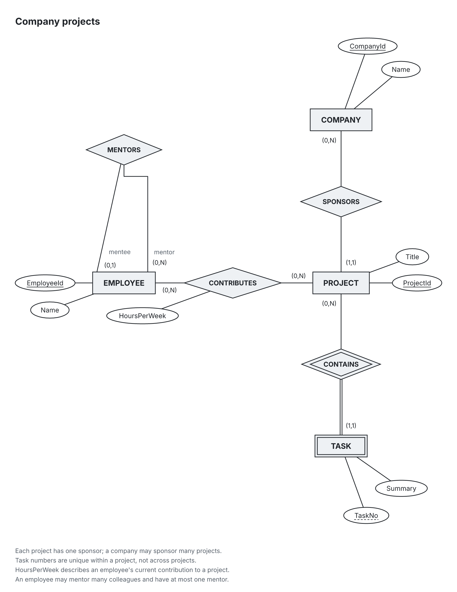
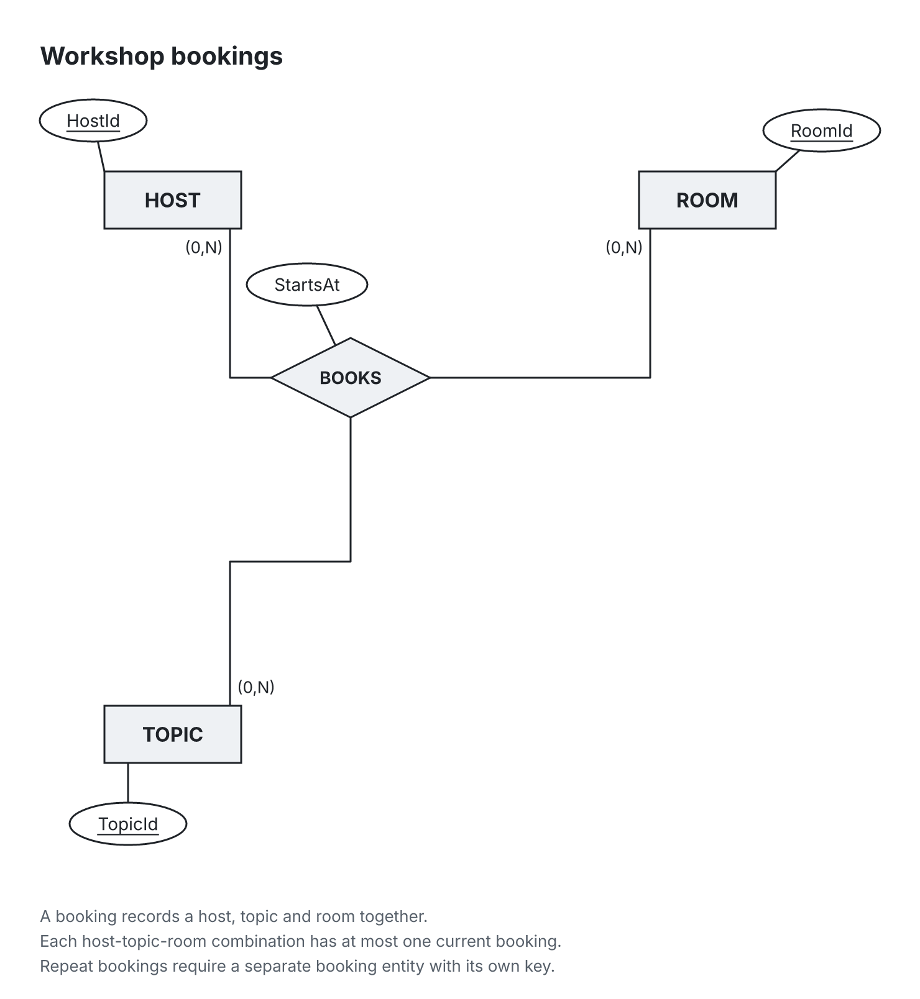

# chen-er

chen-er turns YAML database models into Chen entity–relationship diagrams, checks structural and semantic rules, and exports SVG and PNG. Entities, candidate keys, weak entities, relationship attributes, recursive roles and n-ary relationships stay explicit in the source. Use the CLI, a local viewer or MCP tools to revise the model and inspect the result. `(min,max)` labels describe the participation of the entity at that end.



[SVG](docs/company-project.svg) · [YAML source](examples/company-project.er.yaml)

Try it from a checkout with dependencies installed (Node.js 24):

```sh
npx tsx src/cli/index.ts render examples/company-project.er.yaml -o docs/company-project.svg --png
```

## Write YAML → get a diagram

This ternary relationship records a host, topic and room together. The snippet omits the source's explanatory notes.

<table>
<tr><th>YAML</th><th>Rendered diagram</th></tr>
<tr><td><pre lang="yaml">version: 1
title: Workshop bookings
entities:
  HOST: {attrs: [HostId], keys: [[HostId]]}
  TOPIC: {attrs: [TopicId], keys: [[TopicId]]}
  ROOM: {attrs: [RoomId], keys: [[RoomId]]}
relationships:
  BOOKS:
    ends:
      - {entity: HOST, card: "0..N"}
      - {entity: TOPIC, card: "0..N"}
      - {entity: ROOM, card: "0..N"}
    attrs: [StartsAt]</pre></td><td></td></tr>
</table>

[Full source](examples/ternary.er.yaml) · [SVG](docs/ternary.svg) · [Library example](examples/library.er.yaml)

## Lint before rendering

An identifying relationship is required for a weak entity. Run the checked-in, intentionally invalid [lint example](docs/lint-example.er.yaml):

```sh
npx tsx src/cli/index.ts lint docs/lint-example.er.yaml
```

Actual CLI output (exit code 1):

```text
error:4:11 [weak-without-identifying] Weak entity TASK has no identifying relationship.
  hint: Add a relationship connecting TASK to its owner and set identifies to TASK.
0 errors does not mean the model is right; it means nothing obviously wrong was found.
```

Diagnostics include source positions, rule ids, severity and repair hints. There are five severities. `error` marks a malformed model or a broken ER rule and is the only one that makes `chen lint` and `chen render` exit with code 1. `warning` reports an operational problem with the rendering rather than the model, for example saved layout pins that make the drawing clearly worse (`pins-degrade-layout`); it is always shown, and `--no-course` and `--no-heuristic` do not hide it. `course` marks a course-convention issue (`--no-course` hides it), `heuristic` a modelling-quality suspicion (`--no-heuristic` hides it) and `info` a hint. `chen render --no-pins` ignores the layout file (pins, saved positions and stored engine) without modifying it, which helps to compare against a `pins-degrade-layout` warning. A clean lint result does not establish domain correctness.

## Agents: skill and MCP

The repository [er-diagram skill](skills/er-diagram/SKILL.md) describes the loop: write YAML, lint, fix, render, inspect the PNG, then revise the model or layout pins. Add that directory to your client's skill search path.

Start the stdio MCP server from the checkout:

```sh
npx tsx src/mcp/server.ts
```

From an installed package (`npm install chen-er`), run the server with Node:

```sh
node node_modules/chen-er/bin/chen-mcp.js
```

and configure the client with `"command": "node"` and `"args": ["/absolute/path/to/project/node_modules/chen-er/bin/chen-mcp.js"]`.

For a checkout client configuration, replace the checkout path and launch the client from an environment where `tsx` resolves:

```json
{
  "mcpServers": {
    "chen-er": {
      "command": "npx",
      "args": ["tsx", "/absolute/path/to/chen-er/src/mcp/server.ts"]
    }
  }
}
```

| Tool | Behavior |
| --- | --- |
| `get_schema` | Returns JSON Schema, a YAML example, notation guidance, lint rules and the correctness disclaimer. |
| `lint_er` | Takes exactly one of `model` (YAML text) or `path`; optional `disable` rule ids. Returns diagnostics and the disclaimer. |
| `render_er` | Takes exactly one of `model` or `path`; optional `engine`, `out` and positive PNG `scale` (default 2). Returns a PNG image plus diagnostics, severity counts and written paths. |

File input loads sibling layout settings. Relative paths resolve against the server's working directory. `render_er` with `out` replaces the SVG and its sibling PNG; without `out`, it writes no files. Invalid models return a tool error and no image.

## Local viewer

`chen serve` serves the viewer on loopback at `http://127.0.0.1:5178` by default. From source:

```sh
npx tsx src/cli/index.ts serve examples/company-project.er.yaml
```

Open the printed URL. Saves to the YAML or sibling layout file refresh the diagram. Pan and zoom, inspect linked findings, drag shapes to pin them, switch layout engines and export SVG/PNG. The viewer saves pins and previous positions in `company-project.er.layout.json`; previous positions keep subsequent layouts stable. Relayout clears those soft positions while retaining pins. `--open` opens the browser; `--port` changes the port. Stop with Ctrl+C.

Click an entity or relationship to open its actions. Selection emphasizes all ends and labels of connected relationships; **Focus** fits that neighborhood without changing the layout. The viewer does not edit the model; it writes only the layout file. An agent or your text editor changes the YAML, and the viewer refreshes.

**Undo / Redo** (Cmd/Ctrl+Z and Cmd/Ctrl+Shift+Z outside text fields) restore the layout file for the last 50 layout changes in this server session: pins, reset, engine changes and relayout. External model or layout edits clear that history. Writes compare the layout file's byte revision and recheck the disk before each atomic replacement; this is not a filesystem lock shared with external editors, so a write in the final check/rename interval can still race. On conflict, the viewer preserves the external file and clears history. Exports omit selection and action controls.

### Agent panel

`chen serve model.er.yaml --agent claude [--agent-cwd <dir>]` adds an **Agent** tab where you ask for model changes in plain language. Each request runs your installed, logged-in Claude Code CLI headless (`claude -p ... --output-format stream-json --verbose --permission-mode acceptEdits --allowedTools ... --add-dir <model dir>`), with `--agent-cwd` as its working directory (default: the model's directory); later requests continue the same session with `--resume`. Besides file edits (`acceptEdits`), only the tools the prompt asks for are pre-approved: the same CLI's `lint` command (`Bash(<lint command>:*)`) and the chen-er MCP tools `mcp__chen-er__lint_er` and `mcp__chen-er__render_er`. The agent inherits the environment variables of the `chen serve` process, so project-specific switches can be set when starting the server. No API key is involved. The agent edits the YAML and the diagram refreshes through the usual live reload; the server never lets it change the layout file. One request runs at a time and can be cancelled. **Undo** restores the model bytes from before the most recent model-changing request, only while the file is still exactly as that request left it.

With `--agent`, the printed URL carries a one-time token (`http://127.0.0.1:<port>/?t=<token>`); `--open` opens that URL. Agent API calls must send that token in `X-Chen-Token`. Without `--agent`, the agent API does not exist. `--agent codex` is reserved and currently rejected. History lives in memory until the server stops. Contract: [docs/agent-panel.md](docs/agent-panel.md).

## Install and quick start

Use Node.js 24. To use the packed package in another project (verified with a clean install of the tarball; the registry release is pending):

```sh
npm install chen-er        # or: npm install ./chen-er-0.1.0.tgz
npx chen init model.er.yaml
npx chen lint model.er.yaml
npx chen render model.er.yaml --png
```

From a checkout, install the checkout's dependencies with `npm ci`, then the one-command render above runs without a build. This README documents source and built-checkout usage; npm publication is pending the [packaging checklist](docs/npm-readiness.md).

To use the built CLI:

```sh
npm run build
node bin/chen.js render examples/ternary.er.yaml -o docs/ternary.svg --png
```

The package declares the executable name `chen`. In the following commands, use `node bin/chen.js` in a built checkout, or `npx tsx src/cli/index.ts` from source:

| Command | Result |
| --- | --- |
| `chen init model.er.yaml` | Create a starter model; refuses to overwrite unless `--force` is supplied. |
| `chen lint model.er.yaml` | Check parsing and model rules; `--json` returns machine-readable diagnostics. |
| `chen render model.er.yaml --png --report` | Write SVG/PNG and print overlap, crossing and compactness measurements. |
| `chen render model.er.yaml --engine stress --fresh` | Choose another engine and ignore saved positions; pins still apply. |
| `chen serve model.er.yaml` | Start the local viewer. |
| `chen schema` | Print JSON Schema. |
| `chen rules` | List rule ids, severities and descriptions. |

CLI exit codes: 0 success, 1 model errors, 2 usage or I/O failure. Rendering writes beside the model unless `-o` supplies an output path. PNG uses bundled Inter fonts at 2× scale by default; `--scale` changes raster scale.

## Model reference and architecture

See the [model reference](docs/model-reference.md) for keys, attributes, cardinalities, weak entities, recursive roles and layout files. The structural contract is [schema/er.schema.json](schema/er.schema.json).

The shared pipeline is `parseModel → lint → layout → renderSvg`; the application layer handles files and PNG conversion. `src/core` is browser-safe and shared by CLI, MCP and viewer. Layout produces final geometry; the SVG renderer draws it without placing shapes. Fonts and text metrics are bundled.

The default engine is `layered`. Its pipeline evaluates semantic placements first and falls back to layered/stress candidates when its quality targets are not met. `stress` also uses this candidate pipeline; `simple` is a separate engine. Pins store node centers in pixels and override automatic placement.

Regenerate all top-level public example images with the current engine:

```sh
npx tsx scripts/gen-docs.ts
```

The generator writes `docs/<name>.svg` and `.png`, ignores saved soft positions, respects explicit pins, and stops on errors. It does not recurse into directories.

Development checks:

```sh
npx tsc --noEmit
npx vitest run
```

## Status and roadmap

Version 0.3.0 implements YAML parsing, rule diagnostics, SVG/PNG rendering, the default `layered` engine with semantic placement (1:N hierarchy top-down, diamonds between their entities, participation labels on their own edge) plus `stress` and `simple` alternatives, saved pins and soft positions with stable re-layout, the local viewer, and three MCP tools. Automatic layout still needs visual review on large models: a 26-entity model takes about 20 seconds in 0.3.0 (about 2 seconds on the unreleased main branch) and has many edge crossings. EER `specializations` are reserved in the schema but currently rejected with `unsupported-eer` and are not drawn. See [CHANGELOG.md](CHANGELOG.md).

Next work: npm publication, faster and clearer layouts for large models (including subject-area diagrams), and EER rendering. These are planned areas, not supported features or release dates.

## License

Code: [MIT](LICENSE). Bundled Inter fonts: [SIL Open Font License 1.1](assets/fonts/OFL.txt).
